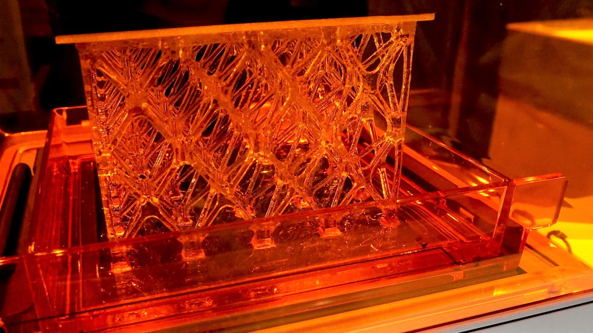
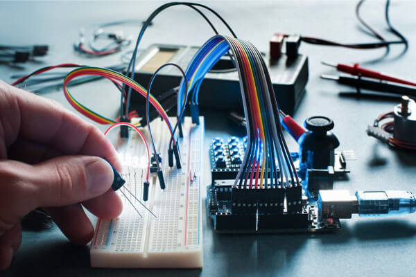

---
title:
- Diapositive allechante pour donner envie de se documenter
author:
- Malik and Samuel
theme:
- Antibes
colortheme:
- beaver
---
# Chimie:

 \

\

# Chimie

## Reactions chimiques poudre/laser et resine/laser

- Duree d'exposition 

- intensite 

- longueur d'onde optimale par rapport aux resines, tolerance de la longueur d'onde du laser

- Temperatures ambiante pour la poudre, densite pour tamisage de la poudre 

# Optique

# Optique

##Optique laser/miroiterie

- Influence de la taille de la tache sur la resolution de la piece

- Choix des types de miroir/ls/lentille (resistance aux uv et ir selon l'intensite, pas de filtrage)

- echauffement de la miroiterie/laser

# electronique 

 \

\ 

# electronique 

## circuits electroniques Arduino/raspberry pi

- Se documenter en electronique

- communication avec le laser (binaire/analogique en Volt)

- Ajustabilite des lasers

# Programmation

 \

 \ 

# Programmation

## Programmation code principal / IHM

- Communication entre raspberry pi et arduino (binaire, i2c)

- C++ / qt

- Interpretation G code 

## Programmation RT / PLC
 - Optimiser le système :
  - Code et language+biblio opti au RT (norme GRAFCET utile également)
  - Noyau RT (et tester différentes configurations)
  - OS sur la RAM (et fichiers/périfs GPIO monter sur la RAM ?)
  - Désactiver les services non utilisés
  - Multithreading ? Processus parallèles ?
 - Utilisation de BENCHMARKs pour ÉVALUER les gains significatifs ou non, puis faire un CHOIX rationnel.

#reseau
 \

\
#reseau

# Mecanique
 \

\
# Mecanique

# LINKS 

 

# LINKS

## Chimie 

## optique

## electronique

## Programmation

# LINKS

## Reseau

## Linux-RT

 - Général :
  - https://rt.wiki.kernel.org/index.php/Main_Page
  - https://rt.wiki.kernel.org/index.php/HOWTO:_Build_an_RT-application
 - Interupt & context switch :
  - https://www.quora.com/What-is-the-difference-between-context-switching-and-interrupt-handling
  - https://notes.shichao.io/lkd/ch7/
  - https://fr.wikipedia.org/wiki/Interruption_mat%C3%A9rielle
 - Préemption :
  - https://devarea.developpez.com/linux-comprendre-preemption-noyau/
  - https://fr.wikipedia.org/wiki/Multit%C3%A2che_pr%C3%A9emptif
 - Latency :
  - http://people.redhat.com/williams/latency-howto/rt-latency-howto.txt
 - Jitter :
  - https://www.youtube.com/watch?v=K44eRt852vs
  - https://www.google.com/url?sa=t&rct=j&q=&esrc=s&source=web&cd=5&ved=2ahUKEwjDhof0odXjAhW85OAKHTKiC48QFjAEegQIAxAC&url=https%3A%2F%2Fwww.captronic.fr%2Fdocrestreint.api%2F2137%2Fa536f4bcc9ec4cd16ba821ebe9148dfdefcd70c9%2Fpdf%2F2_LINUXRT.pdf&usg=AOvVaw3U_sXhBrH2ROZliTbEPA1P

## Mecanique

