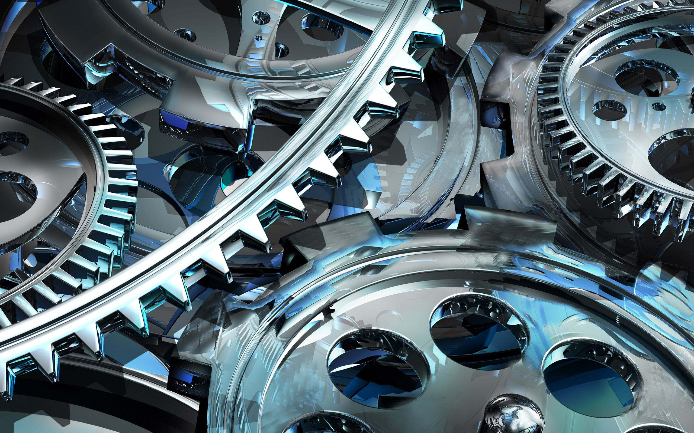

---
title:
- Diapositive allechante pour donner envie de se documenter
author:
- Malik and Samuel
theme:
- Antibes
colortheme:
- beaver
---
# Chimie:

 \

\

# Chimie

## Reactions chimiques poudre/laser et resine/laser

- Duree d'exposition 

- intensite 

- longueur d'onde optimale par rapport aux resines, tolerance de la longueur d'onde du laser

- Temperatures ambiante pour la poudre, densite pour tamisage de la poudre 

# Optique

# Optique

##Optique laser/miroiterie

- Influence de la taille de la tache sur la resolution de la piece

- Choix des types de miroir/ls/lentille (resistance aux uv et ir selon l'intensite, pas de filtrage)

- echauffement de la miroiterie/laser

# electronique 

 \

\ 

# electronique 

## circuits electroniques Arduino/raspberry pi

- Se documenter en electronique

- communication avec le laser (binaire/analogique en Volt)

- Ajustabilite des lasers

# Programmation

 \

 \ 

# Programmation

## Programmation code principal / IHM

- Communication entre raspberry pi et arduino (binaire, i2c)

- C++ / qt

- Interpretation G code 

#reseau
 \

\
#reseau

# Mecanique
 \

\
# Mecanique

# LINKS 

 

# LINKS

## Chimie 

## optique

## electronique

## Programmation

# LINKS

## Reseau

## Mecanique

